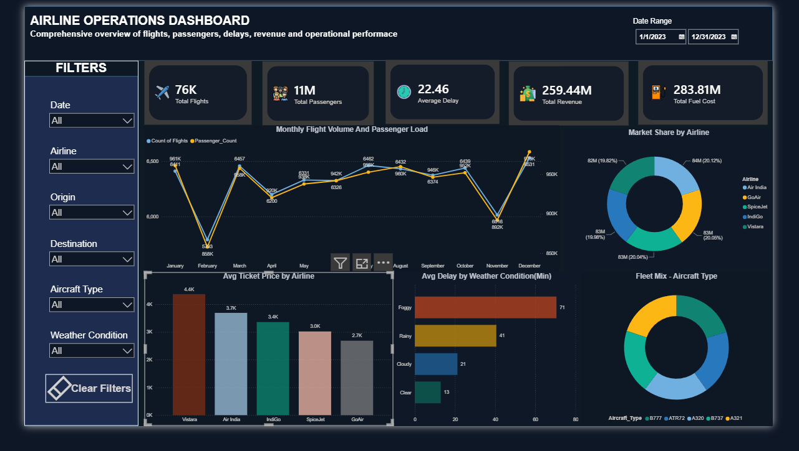

# Airline Operations Analytics

## Dashboard Preview



## Overview

This project is an end-to-end data analytics solution built using Python, Pandas, and Power BI to analyze airline operations and performance.

The project involved cleaning and transforming airline operational data using Pandas, performing exploratory data analysis (EDA), engineering additional features, and developing an interactive Power BI dashboard to monitor key operational and business metrics.

## Objectives

* Analyze airline operational performance
* Monitor passenger traffic and flight activity trends
* Evaluate the impact of weather conditions on delays
* Compare airline market share and pricing strategies
* Explore aircraft fleet distribution
* Track revenue and operational costs
* Develop an interactive business intelligence dashboard

## Dataset

The dataset contains airline operational information including:

* Airline Name
* Origin and Destination Airports
* Passenger Volume
* Ticket Prices
* Flight Delays
* Fuel Costs
* Aircraft Types
* Weather Conditions
* Flight Duration

## Data Processing

### Python (Pandas)

* Data cleaning and preprocessing
* Missing value analysis
* Datetime conversion
* Outlier detection using IQR
* Feature engineering
* Data transformation for dashboard reporting

### Engineered Features

* Route
* Month
* Day
* Delayed_Flag
* Fuel_Cost_Per_KM
* Price_Per_Hour

## Exploratory Data Analysis

The analysis focused on:

* Passenger traffic trends
* Flight delay patterns
* Route performance analysis
* Ticket price distribution
* Operational cost analysis
* Weather impact on delays
* Airline performance comparison

## Power BI Dashboard

The interactive dashboard includes:

### KPI Cards

* Total Flights
* Total Passengers
* Average Delay (Min)
* Total Revenue
* Total Fuel Cost

### Visualizations

* Monthly Flight Volume and Passenger Load
* Airline Market Share Analysis
* Average Ticket Price by Airline
* Average Delay by Weather Condition
* Fleet Mix by Aircraft Type
* Interactive Filtering and Performance Monitoring

### Interactive Filters

* Date
* Airline
* Origin
* Destination
* Aircraft Type
* Weather Condition

## Key Insights

* Passenger traffic and flight volume remained relatively stable throughout the year, indicating consistent operational demand.

* Weather conditions had a significant impact on delays, with foggy weather generating the highest average delay times compared to rainy, cloudy, and clear conditions.

* Airline market share was distributed relatively evenly among major carriers, highlighting a highly competitive operating environment.

* Vistara recorded the highest average ticket price (₹4.4K), while GoAir reported the lowest average ticket price (₹2.7K), reflecting different pricing strategies.

* Aircraft utilization was distributed across multiple fleet types, providing a balanced operational mix.

## Tech Stack

* Python
* Pandas
* NumPy
* Matplotlib
* Power BI
* DAX
* Power Query
* Git
* GitHub

## Project Structure

```text
airline-operations-analytics/
│
├── data/
│   └── airline_cleaned.csv
│
├── notebooks/
│   └── Airline_Operations_EDA.ipynb
│
├── dashboard/
│   ├── Airline_Dashboard.pbix
│   └── Dashboard_screenshot.png
│
└── README.md
```
